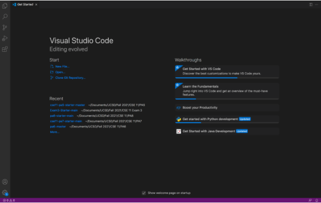
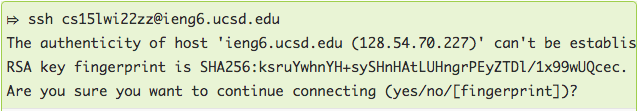
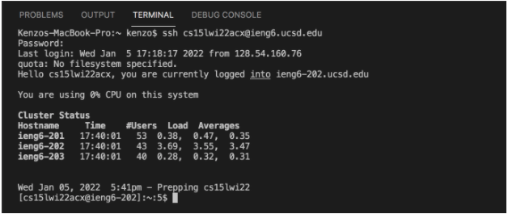
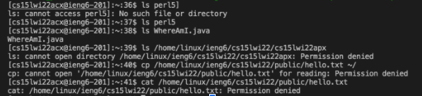
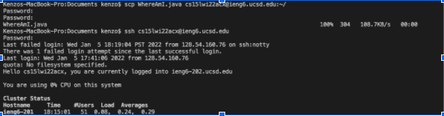
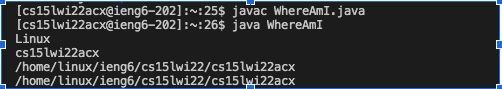
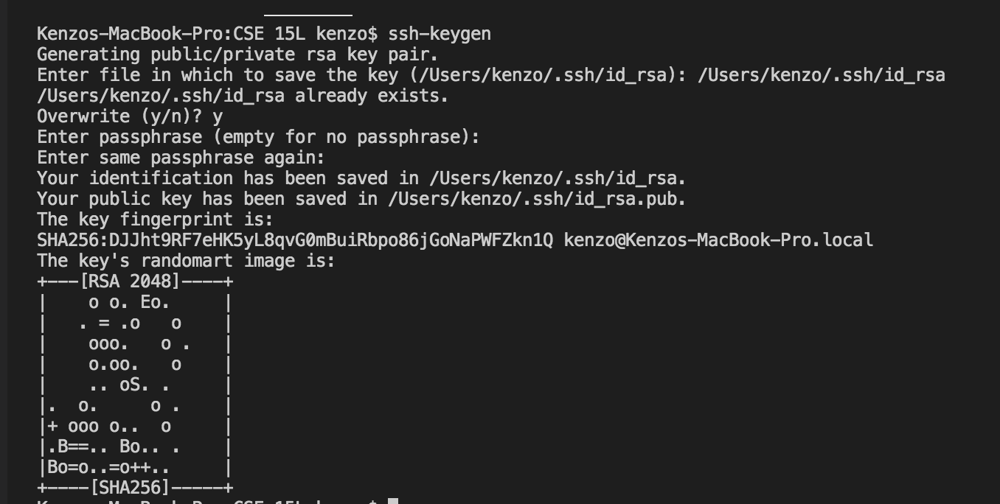
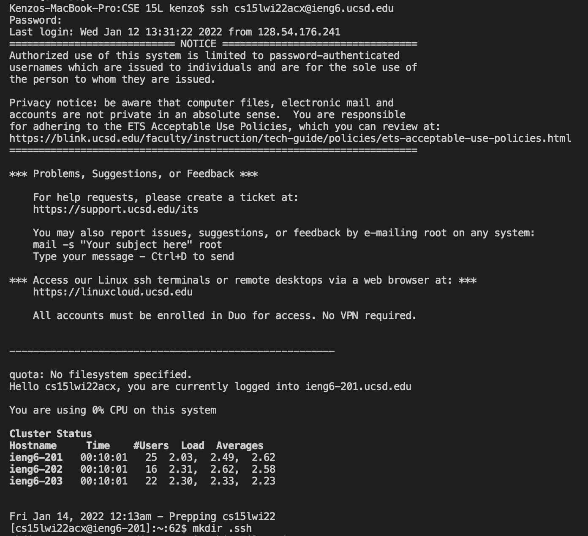
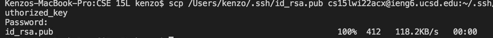
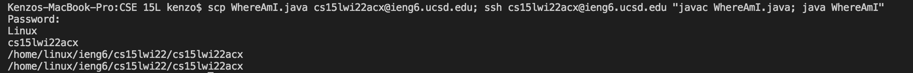

# Remote access and the Filesystem

## Hi there! 

Today we will learn how to log into a course-specific account on ieng6!

## Step 1: Install Visual Studio Code
1. Go to the Visual Studio Code website [by clicking this link!](https://code.visualstudio.com/)
2. Download the Visual Studio Code according to what OS you are using
3. Install it on your computer 

When you open the Visual Studio Code it will look like this


## Step 2: Connect Remotely

Some CSE courses use course-specific accounts and you can look up your course-specific account for CSE15L in that link:
[https://sdacs.ucsd.edu/~icc/index.php](https://sdacs.ucsd.edu/~icc/index.php)

Next, we will going to use Visual Studio Code to connect to the remote computer using Visual Studio Code's remote option.

1. Open a terminal in VSCode by pressing (Command + `) or you can go to the Terminal tab on top of your screen and press the New Terminal menu option.
2. Then write this command in the terminal but replace the `acx` with the letters in your course specific account:

    `$ ssh cs15lwi22acx@ieng6.ucsd.edu`

    **After the five is the letter "l" and not number one**

    Since this is likely the first time you’ve connected to this server, you will probably get a message like this:
    

    When you are connecting to the server for the first time, it is common to get this message. 
3. Then type `yes` and press enter.
4. Enter your password and press enter again.
5. The output should look like this after you have given your password and are logged in:


Now your terminal is connected to a computer in the CSE basement, and any commands you run in your terminal will run on the remote computer. 

The local computer (our computer that we are using) is called the client and the computer in the basement is called the server, based on this connection.

To disconnect from the server (remote computer) run this command in the terminal:

`exit`

Or you can also disconnect from the server by pressing:
Ctrl + D


## Step 3: Running some commands on the terminal

Try running these commands both on your computer and on the remote computer after ssh-ing:
* `cd`
* `ls`
* `pwd`
* `mkdir`
* `cp`
* `cd ~`
* `ls -a`
* `ls -lat`
* `ls <directory>` where directory is `/home/linux/ieng6/cs15lwi22/cs15lwi22acx`, and replace the acx with your friend's username
* `cp /home/linux/ieng6/cs15lwi22/public/hello.txt ~/`
* `cat /home/linux/ieng6/cs15lwi22/public/hello.txt`

This is what I got from running some of the commands:


Command purposes:
* `ls` is to list all the files in the directory
* `cd` is to change directory
* `pwd` is to show the path working directory
* `mkdir` is to make a new directory
* `cp` is to copy the file

## Step 4: Moving Files over SSH with scp
In the last step, we saw that we can do several work on your local and on the remote computers. One of the most important steps in working remotely is to be able to copy file back and forth between the computers. 

We will try a way to copy a file or more than one files from our local computer to a remote computer by using the command `scp`, and we always run the command `scp` from the client (or the local computer, and not logged into **ieng6**)

1. Create a new file on your computer called `WhereAmI.java` and put the following contents into it:
```
class WhereAmI {
  public static void main(String[] args) {
    System.out.println(System.getProperty("os.name"));
    System.out.println(System.getProperty("user.name"));
    System.out.println(System.getProperty("user.home"));
    System.out.println(System.getProperty("user.dir"));
  }
}
```
2. Run it using `javac` and `java` commands on your local computer. (Make sure you have installed java on your computer)
3. In the terminal from the directory where you made this file, run this command (use your username(replace the acx)):

`scp WhereAmI.java cs15lwi22acx@ieng6.ucsd.edu:~/`

You should be prompted for a password just like when you log in with `ssh`.

Your terminal should look like this:


4. log in into **ieng6** with ssh again, and run the command `ls` on the terminal. You should see the file there in your home directory.

Now you can run the file using `javac` and `java` commands on the server(**ieng6** computer) since java is installed on the server.

It should look like this:


Now do the following steps:
1. Have someone on your team start a timer
2. Make a change to WhereAmI.java and save the file
3. Copy the file to the remote server
4. Log into the remote server and run the file
5. Stop the timer.

Record the time to see how long did it take you to edit and copy the file into the remote server.

## Step 5: SSH keys
In the previous steps, we have seen how to log in, run commands, and copy files to a remote server with `ssh` and `scp`. Everytime we log in or run `scp`, we have to type our password. This can waste your time and it is also frustating but there is a way to overcome this problem.

The solution to this problem is - `ssh` keys. The idea behind ssh keys is that a program, called `ssh-keygen`, creates a pair of files called the **public key** and the **private key**. You copy the public key to a particular location on the server, and the private key in a particular location on the client. Then, the `ssh` command can use the pair of files in place of your password. This is a common setup step in lots of work environments that involve code on a server.

To set up, you should run this on your client (local computer):
```
$ ssh-keygen
Generating public/private rsa key pair.
Enter file in which to save the key (/Users/joe/.ssh/id_rsa): /Users/joe/.ssh/id_rsa
Enter passphrase (empty for no passphrase): 
Enter same passphrase again: 
Your identification has been saved in /Users/joe/.ssh/id_rsa.
Your public key has been saved in /Users/joe/.ssh/id_rsa.pub.
The key fingerprint is:
SHA256:jZaZH6fI8E2I1D35hnvGeBePQ4ELOf2Ge+G0XknoXp0 joe@Joes-Mac-mini.local
The key's randomart image is:
+---[RSA 3072]----+
|                 |
|       . . + .   |
|      . . B o .  |
|     . . B * +.. |
|      o S = *.B. |
|       = = O.*.*+|
|        + * *.BE+|
|           +.+.o |
|             ..  |
+----[SHA256]-----+
```

This is what I get in my terminal:


This created two new files on your system; the **private key** (in a file `id_rsa`) and the **public key** (in a file `id_rsa.pub`), stored in the `.ssh` directory on your computer.

Now we need to copy the **public** (not the private) key to the `.ssh` directory of your user account on the server by running these commands:
```
$ ssh cs15lwi22zz@ieng6.ucsd.edu
<Enter Password>
# now on server
$ mkdir .ssh
$ <logout>
# back on client
$ scp /Users/joe/.ssh/id_rsa.pub cs15lwi22@ieng6.ucsd.edu:~/.ssh/authorized_keys
# You use your username and the path you saw in the command above
```

It will look like this:


Then this is the one on your local computer:


Once you do this, you should be able to `ssh` or `scp` from this client to the server without entering your password.

## Step 6: Optimizing remote running
Use the previous steps to come up with the most efficient process you can for making a local to `WhereAmI.java`, then copying it to the remote server and running it.

Some hints:

* At the end of the ssh command, you can write a command in double quotes to directly run it one the remote server, then exit. For example, this will log in and list the home directory on the remote server:

`$ ssh cs15lwi22acx@ieng6.ucsd.edu "ls"`

* You can use semicolons to run multiple commands on the same line in most terminals. For example, try:

`$ cp WhereAmI.java OtherMain.java; javac OtherMain.java; java WhereAmI`

* You can use the up-arrow on your keyboard to recall the last command that was run


The process I did is:

1. Edit the `WhereAmI.java` file on my local computer and save the changes
2. Then run the command:

`$ scp WhereAmI.java cs15lwi22acx@ieng6.ucsd.edu; ssh cs15lwi22acx@ieng6.ucsd.edu "javac WhereAmI.java; java WhereAmI"`

3. Then it will ask for the password and enter your password.

Your output should look like this:


4. Then I made further changes to my code in `WhereAmI.java` 
5. To upload and run it again, I just need to press the up-arrow key and press enter.

## Congratulations! You reached the end of this lab.


