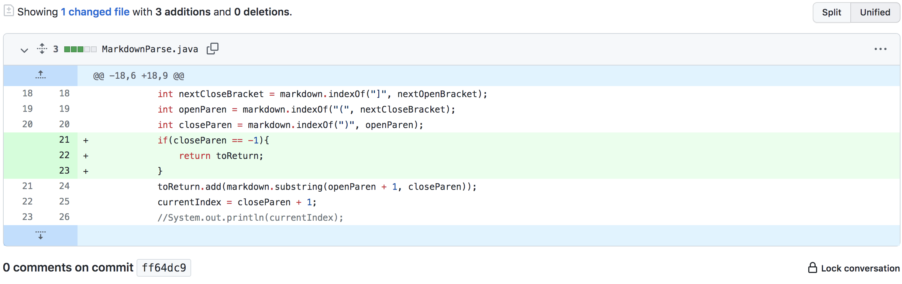
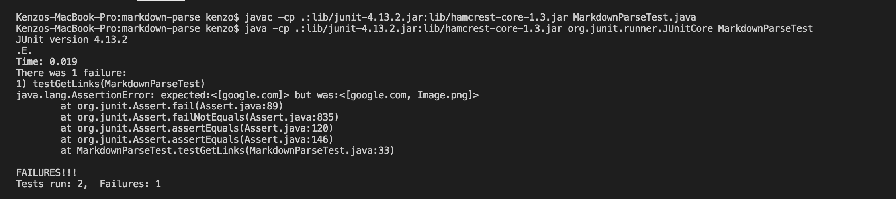
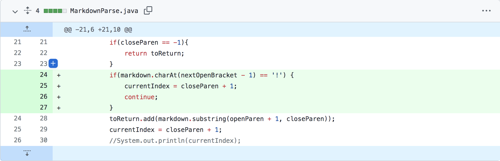
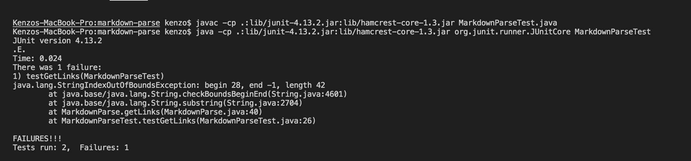
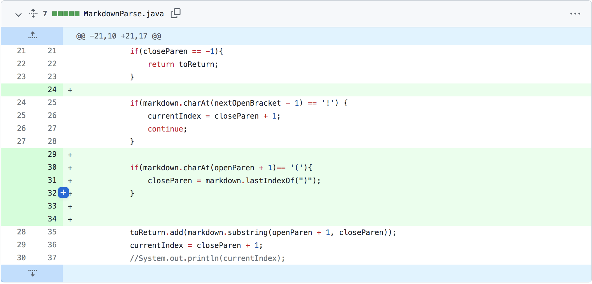
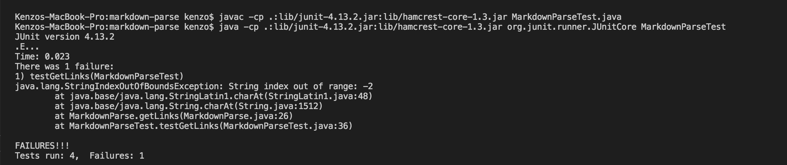

# Incremental programming, debugging and testing

## First Code Change

[Link to test file 1](https://github.com/kenzoputraku/markdown-parse/blob/main/image.md)

### Symptom

The failure inducing input file (image.md) has a line that contains the reference to the image. The (bug in the) code is not able to distinguish between that line and the line that contains the link so it produces the symptom where the file name (or reference to the image) is included in the array of the links.

## Second code change 

[Link to the test file 2](https://github.com/kenzoputraku/markdown-parse/blob/main/incorrect.md)

### Symptom 

The failure inducing file contains a link format that is incorrect because it doesn't have a closing parenthesis at the end of the link, so (the bug) in the code the indexOf for the closeParen returns -1 since it can't find the "(" String. This causes the symptom of StringIndexOutOfBoundsException when the code call the substring method using a -1 index.

## Third code change

[Link to test file 3](https://github.com/kenzoputraku/markdown-parse/blob/main/doubleParenthesis.md)

### Symptom

The failure inducing file contains a line that have a link format but have double open and closing parenthesis. The symptom is when the code gives index out of bounds exception. The bug in the code is that it doesn't check whether the link has a double parenthesis or not so it tries to access an index in the input that is out of bounds.