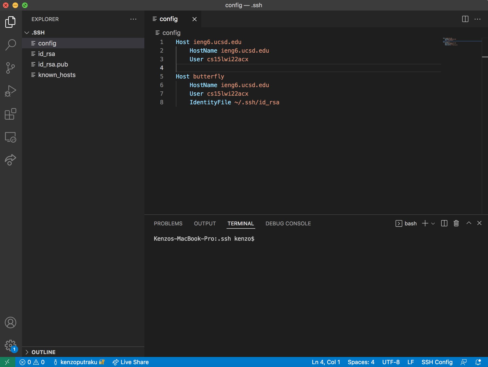
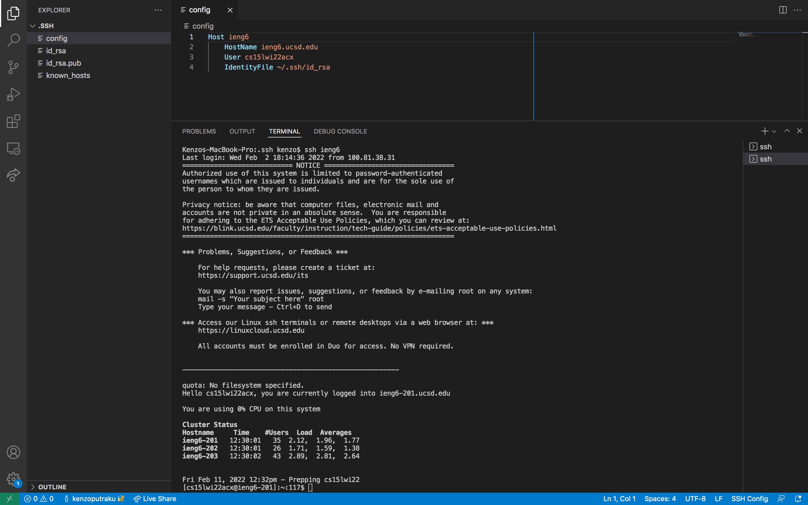
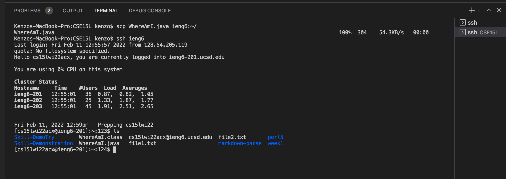

# Streamlining ssh Configuration

## .ssh/config file



This is my config file in the .ssh folder and I edited it using visual studio code.
To find this .ssh folder, I type 
```
code .ssh
```
in the terminal and it takes me to the `.ssh` folder and from there I created a new file and name it `config` and inside it I put the code
```
Host ieng6
    HostName ieng6.ucsd.edu
    User cs15lwi22acx
    IdentityFile ~/.ssh/id_rsa
```

## ssh command to log in to my ssh account

 

 to log in into my ssn I run the command
 ```
 ssh ieng6
 ```
 on the terminal and this will run the code in the `config file`which helps me login into the ssh server. The `ieng6` portion is called the alias.

## scp command to copy a file to my account



To copy a file to my account, first I need to change the directory to where it contains the file I want to copy so in this case I did
```
cd /Users/kenzo/Documents/UCSD/CSE15L/
```

After that, I ran the command
```
scp WhereAmI.java ieng6:~/
```
so that it copy the `WhereAmI.java` file to the home directory in my ssh account. I don't need to type any password or long account name to copy my files to the ssh server because of this `config` file.
