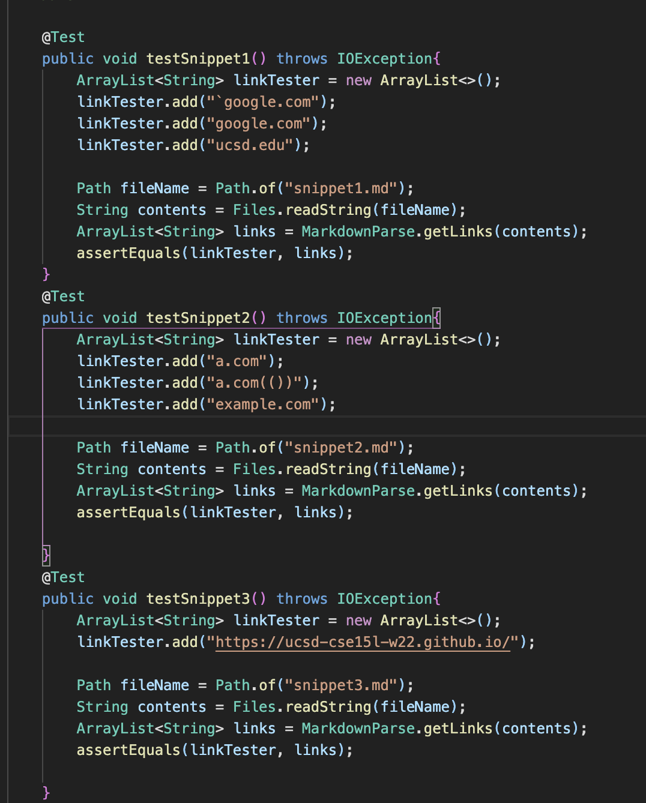
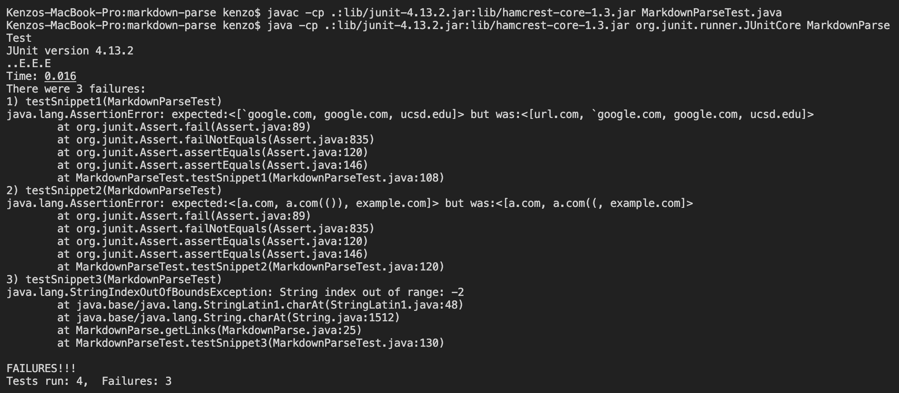
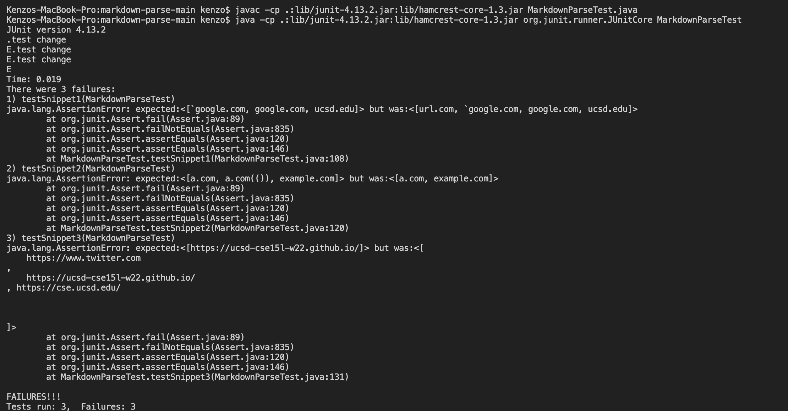

# Week 8 Lab Report

[Link to my markdown-parse repository](https://github.com/kenzoputraku/markdown-parse.git)

[Link to the markdown-parse repository I reviewed](https://github.com/ericwpei/markdown-parse
)

## Junit test

## Output of my version of markdown-parse when running the test

## Output of the version of markdown-parse that I reviewed when running the test

## Do you think there is a small (<10 lines) code change that will make your program work for snippet 1 and all related cases that use inline code with backticks? 
I think there is a small code change that will make my program work for snippet 1. The program is we can put an if statement checking whether if there is a tick at the start of the line, we continue the while loop right away so that the link in that line will not be included in the array. I think we can also use an if statement if the tick is found inside the parenthesis, we can remove the tick using a substring method.

## Do you think there is a small (<10 lines) code change that will make your program work for snippet 2 and all related cases that nest parentheses, brackets, and escaped brackets? 

I think I need to add a big change to my program to fix all related cases that nest parentheses, brackets, and escaped brackets because I need to make a new helper method that involves counting bracket pair or that helps to find the outer open and close brackets or parenthesis.

## Do you think there is a small (<10 lines) code change that will make your program work for snippet 3 and all related cases that have newlines in brackets and parentheses? 

I think I need a big change in my code in order to make my program work for snippet 3 and all related cases that have newlines in brackets and parentheses. I think I need to modify my code in a way that can detect new lines and skip them so that it still can get the links properly.

