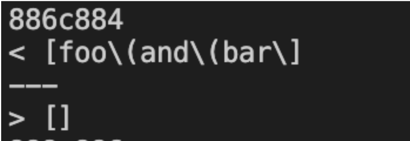
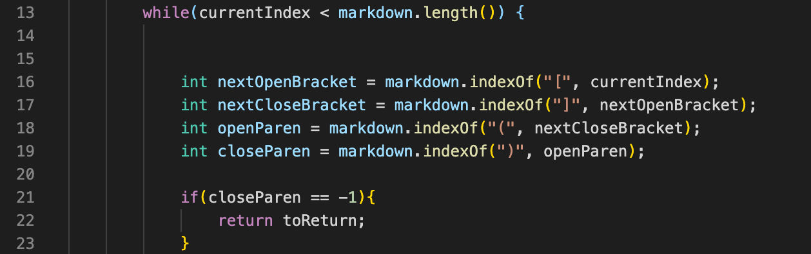
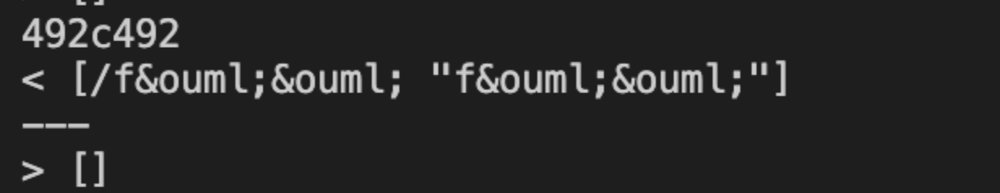

# Week 10 Lab Report 5

## Finding the test with different results
1. I ran the script.sh in the given folder and copy pasted the result into a result.txt file.
2. I ran the script.sh on my own implementation of markdown-parse and copy pasted the result into another result.txt file.
3. Then I ran 
`diff <Path of first result.txt> <Path of second result.txt>` 
on the command line to get the difference.
## Test 1 

The top output is my own implementation while the bottom output is the code given to me. This difference is in the file named 497.md. I think that both implementation are wrong because my code produce an output with missing closing parenthesis and the given code produces an output that is empty. And I think that the expected output is `[foo\(and\(bar\)]` because there are no spaces between them and it's inside the open and close parenthesis, in the correct link format. 

### Bug in my code
I think that the bug in the my code is when there is an extra closing parenthesis inside the link format as it only takes the link before the first closing parenthesis and not the last one.

I think that I can fix this code by changing the `indexOf` method into a `lastIndexOf` method in line 19.

## Test 2

The top output is my own implementation while the bottom output is the code given to me. The test file that causes this difference is 32.md.
I think that the implementation given by the instructor is correct because when there is a space inside the link, we should not add it into the ArrayList so the correct output should be an empty ArrayList.

## Bug in my code
I think that the bug in my code is when there is a space in the link, my implementation is not able to detect the white space and still add the string inside the open and closing parenthesis.

I think inorder to fix this bug, I can add an if statement into line 20, checking whether there is a whitespace inside the link using an indexOf method, and if the method returns a number other than -1, we can continue right away so that the link will not be added and the loop goes on.

